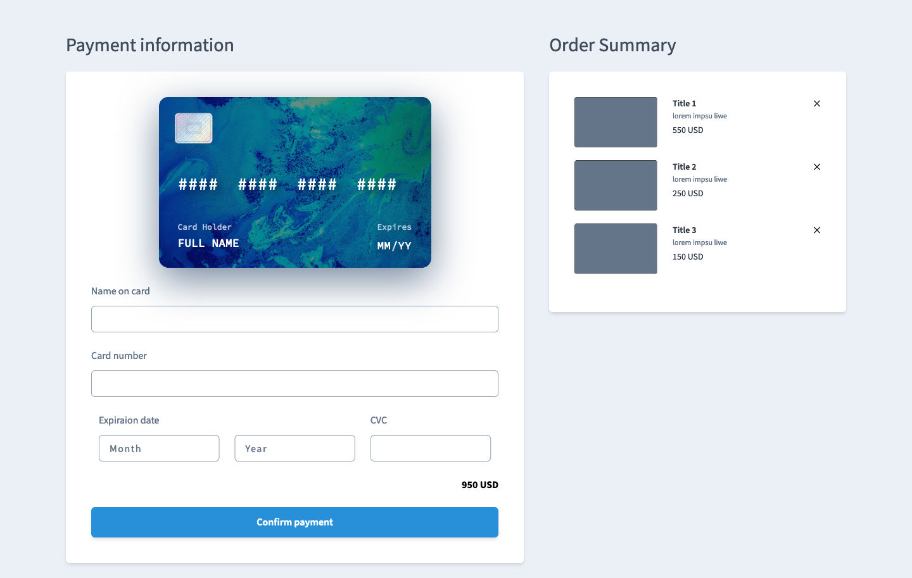

# vue-js-checkout-form
This is small project to check form your payment card and appear summary, result as this photo 😍 :



or 👌🏼:


## Don't forget to join on my channel
Link to subscribe : https://www.youtube.com/@MarwanMAlFalah


## Project setup ⚡️

```
npm install
```

### Compiles and hot-reloads for development ✨

```
npm run serve
```

### Compiles and minifies for production 🚀

```
npm run build
```

### Lints and fixes files 📝

```
npm run lint
```

### For customize configuration 🔍

See [Configuration Reference](https://cli.vuejs.org/config/).
